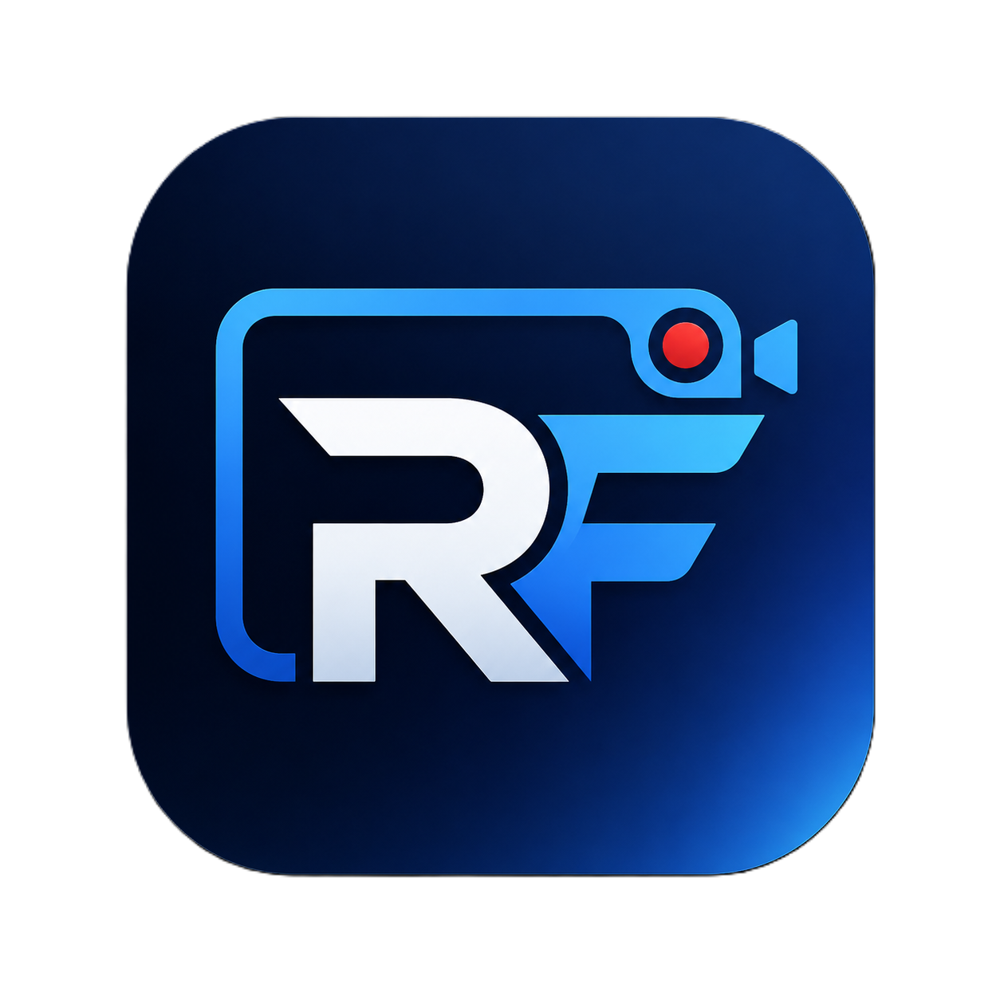

<p align="center">
  
</p>

<h1 align="center">RecordFlow</h1>

<p align="center">
  A focused Windows recorder for screen, camera, and microphone capture, built to stay out of your recording.
</p>

<p align="center">
  <a href="https://github.com/Waqar-743/RecordFlow/releases/latest">
    
  </a>
</p>

## Why RecordFlow Exists

RecordFlow started as a simple idea: recording should feel calm, private, and fast. When you are capturing a lesson, a phone walkthrough, a bug report, or a product demo, the recorder itself should not get in the way.

This app is built for that workflow. Pick what you want to capture, start recording, and let RecordFlow quietly handle the rest. The app can record your screen with microphone audio and an optional camera overlay, and it now lets you draw the exact screen area you want before recording starts.

## Download

Get the latest Windows build from the [RecordFlow releases page](https://github.com/Waqar-743/RecordFlow/releases/latest).

Direct release assets:

- [Download EXE installer](https://github.com/Waqar-743/RecordFlow/releases/latest/download/RecordFlow_1.0.0_x64-setup.exe)
- [Download MSI installer](https://github.com/Waqar-743/RecordFlow/releases/latest/download/RecordFlow_1.0.0_x64_en-US.msi)

## Highlights

- Select a custom screen region with your mouse before recording.
- Keep the RecordFlow window excluded from Windows screen capture.
- Record one display at 720p or 1080p.
- Add an optional camera overlay in any corner.
- Capture microphone audio with volume control.
- Pause, resume, and stop recordings from the app.
- Save recordings automatically to `Documents/RecordFlow/Recordings`.
- Review recent recording history and open files quickly.

## System Requirements

- Windows 10 version 1903, build 18362, or later.
- 4 GB RAM minimum, 8 GB recommended.
- 500 MB free disk space for installation, plus room for recordings.
- 1280x720 display or larger.

RecordFlow uses the Windows Graphics Capture API for efficient screen capture, so older Windows versions are not supported.

Optional hardware:

- Webcam for camera overlay.
- Microphone for voice recording.

## Installation

1. Download the `.exe` or `.msi` installer from the latest release.
2. Run the installer.
3. Launch RecordFlow from the Start Menu.
4. Choose your display or draw a capture area.
5. Start recording.

## Development

```bash
git clone https://github.com/Waqar-743/RecordFlow.git
cd RecordFlow
npm install
npm run tauri dev
```

Build a production installer:

```bash
npm run tauri -- build
```

## Technology

- React 19, TypeScript, and Vite for the interface.
- Tauri 2 and Rust for the desktop shell and recording backend.
- Windows Graphics Capture API through `windows-capture`.
- Windows Media Foundation for H.264/AAC encoding.
- `nokhwa` for camera access.
- `cpal` for microphone capture.

## Troubleshooting

If recording does not start:

- Make sure you are on Windows 10 version 1903 or newer.
- Close other screen recording apps.
- Check that at least one input is enabled.
- Confirm your display, camera, or microphone is connected.
- Restart RecordFlow after changing device permissions.

If direct download links do not work, open the [latest release](https://github.com/Waqar-743/RecordFlow/releases/latest) and download the files manually.


### Build with a headache 
